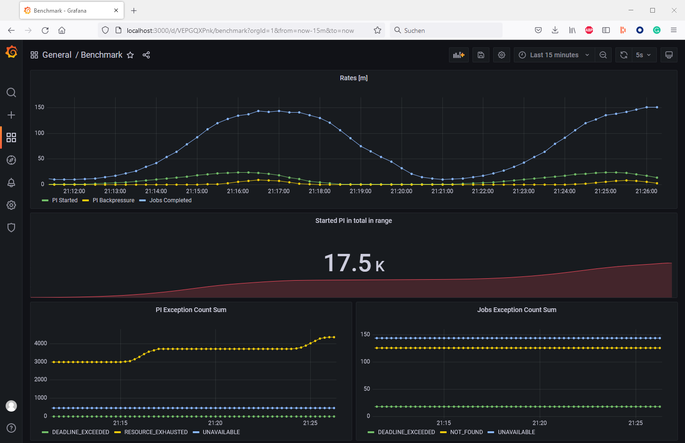

# Camunda Cloud Benchmark Starter

Spring Boot project to run benchmarks on Camunda Cloud.

The project 

* Starts process instances at a given rate
* The rate will be adjusted based on backpressure, so it should find a sustainable starter rate automatically
* Completes tasks in the processes


# How-to run

```bash
mvn spring-boot:run
```

Or 
```bash
docker run berndruecker/camunda-cloud-benchmark:main
```

You can configure 

- everything [Spring Zeebe](https://github.com/camunda-community-hub/spring-zeebe) understands
- additional parameters for the benchmark as listed below

The design is, that you only run this one application for driving your benchmark. 

If you benchmark big clusters and cannot produce enough load, you can simply scale this application (you might want to adjust the `benchmark.startPiReduceFactor` of the properties as backpressure is then "distributed" over various load generators)
 

## Configuration Properties

See https://github.com/camunda-community-hub/camunda-cloud-benchmark/blob/main/src/main/resources/application.properties

## Thoughts on load generation

### Job Acquisition, Job Completion, and Process Start

The benchmark project starts all three types of work: acquire jobs, complete those jobs and start new process instances. The different work items compete for resources on the broker.

The current configuration gives maximum priority to jobs, as it is important that all open tasks can be completed. Otherwise open tasks will pile up and you eventually might never catch up.

Zeebe itself whitelists job completions on backpressure, which means, no backpressure ever on job completions. That also means, whenever the system is busy with tasks/jobs, no process instances can be started, as this will experience a lot of backpressure.

### Synchronous And Asynchronous Work


Everything in this benchmark project is executed asynchronously using various schedulers and thread pools.

Overall, the code itself does not do very compute intensive things, but basically waits for network I/O most of the time. By using asynchronous/reactive programming, one application should be able to produce a lot of load. 

As a consequence, no synchronous code is used, and also ``waitForResults`` from Zeebe is not used at all.

### Do we need backpressure and what's an acceptable limit?

When you try to optimize for cluster throughput you want to get a number what a specific cluster can do (focusing on Zeebe for the moment). To get the maximum throughput you need some backpressure, otherwise you are not working at the limit. This is the "how far can we push this perspective".
The current assumption is 10% of backpressure gets us there.

A normal user would probably strive for 0% backpressure. If we accept only 0.5 % backpressure, we  still know that if we increase the start rate just a little bit, backpressure will kick in.

The "target" backpressure can be configured:

```properties
benchmark.maxBackpressurePercentage=10.0
```

# Collect and inspect metrics

The application provides some metrics via Spring Actuator that can be used via http://localhost:8088/actuator/prometheus for Prometheus.

The contained docker-compose starts up a prometheus/grafana combo  

```
cd grafana
docker compose up
```

This will scrape those metrics and allow inspecting it

* via Prometheus, e.g. http://localhost:9090/graph?g0.expr=startedPi_total&g0.tab=0&g0.stacked=0&g0.show_exemplars=0&g0.range_input=1h 
* via Grafana, e.g. http://localhost:3000/d/VEPGQXPnk/benchmark?orgId=1&from=now-15m&to=now



# Todos

- Only pick up jobs from "my" process
- Wait for results & count completions
- Extract stuff so that it can be used as library and provide an example (Benchmark Starter), own code for startzing and job completion (but recognize/handle backpressure)
- Get information about job activation back pressure
  - Check if we need to look at JobActivation-Backoff?
- Check if start exceptions are counted correctly
- Document properties and examples
  - Process Model from URL
  - Payload from URL
  - Pool Size Parameters
- Swap Metrics recorder (maybe have more flexibility on timeline, allow plotting values over time)